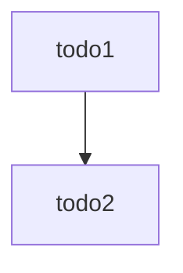

# What is this?
This is a light client for Tanchain. It runs locally on a user's machine.
It provides an API they can use locally to submit queries against the chain.

This component runs on GraphQL, so it mainly processes GraphQL queries
and generates JSON responses.

# Usage
The following command will start the server

```bash
go run server.go
```

- You can go to the GraphQL playground on the `/` endpoint of the server.
- The API is hosted on the `/query` endpoint.

# Context / Design



# Development

The GraphQL schema for this local server is managed using
[[https://github.com/99designs/gqlgen#readme](gqlgen)]. Please see their docs
to learn about modifying the schema, and how that changes the code here.
